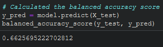

# Credit_Risk_Analysis
## Overview 
In this challenge we were tasked to assess the inherent credit risk. We achieved this using many different forms of machine learning to ensure our data was properly analyzed. This challenge we used random over sampler, SMOTE, cluster centroids, SMOTEENN, balanced random forest classifier, and easy ensemble classifier.

## Results
- Random Over Sampler

The accuracy of the ROS is a decent %65.

The classification report shows us that the recall is around %60 with a precision of %99.

- SMOTE

The accuracy of the SMOTE is a decent %66.

The classification report shows us that the recall is around %69 with a precision of %99.

- Cluster Centroids

The accuracy of the CC is a decent %58.

The classification report shows us that the recall is around %49 with a precision of %99.

- SMOTEENN

The accuracy of the SMOTEENN is a decent %65.

The classification report shows us that the recall is around %58 with a precision of %99.

- Balanced Random Forest Classifier

The accuracy of the BRFC is a decent %99.

The classification report shows us that the recall is around %100 with a precision of %100.

- Easy Ensemble Classifier

The accuracy of the EEC is a decent %99.

The classification report shows us that the recall is around %100 with a precision of %100.

## Summary
Now that the analysis is complete, we now can look at all the information available to make a clear and justified decision on which agorithm to use for future credit risk analysis. I personally would prefer using the Balanced Random Forest Classifier, it allows us to not only improve our accuracy score by adding more estimators but will also increase our recall and precision. I therefore think the Balanced Random Forest Classifier is best as we can also check feature importance and find ways to improve our analysis even further.
